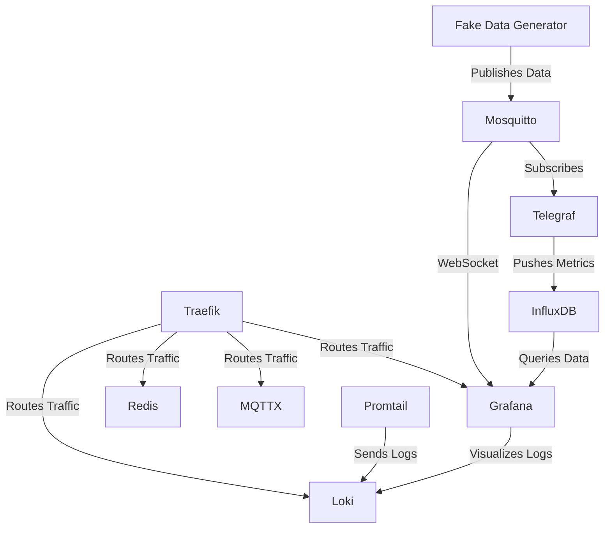

# Service Overview and Interaction

The system consists of various services running in Docker containers, with each service serving a specific role in the system. Here's how they interact and work together:

1. **Traefik (Reverse Proxy)**:
   - Acts as the reverse proxy for all services. It handles routing external traffic to the appropriate internal services. Traefik listens on ports 80 (HTTP) and can route requests to services like Grafana, Redis, MQTTX, Loki, etc.
   - Traefik uses Docker labels to dynamically configure routes to different services within the system.

2. **Redis**:
   - A Redis stack is deployed to handle caching and potentially fast real-time data storage. It can be accessed through the `/redis` path via Traefik. 
   - It interacts with other services requiring fast, lightweight caching.

3. **InfluxDB**:
   - Stores time-series data. It is primarily used to ingest and store sensor data or other time-series metrics generated within the system.
   - Telegraf pushes metrics to InfluxDB, and Grafana queries this data for visualization.

4. **Mosquitto (MQTT Broker)**:
   - The MQTT broker is responsible for handling message-based communication. It allows for the publication and subscription of topics, primarily used for IoT sensors or devices.
   - The fake-data-generator pushes data to this broker, and other services (like Telegraf) can subscribe to topics.
   - **Sensor data is pushed to Mosquitto via MQTT, and later fetched via WebSocket into Grafana using Grafana Live for real-time display.**

5. **Telegraf**:
   - Telegraf acts as a collector of metrics and pushes data to InfluxDB. It connects to the Mosquitto broker to subscribe to sensor data topics.
   - It monitors the system, collecting data from services and pushing it to InfluxDB for long-term storage.

6. **Fake Data Generator**:
   - This service simulates sensor data by publishing data to the MQTT broker. The data is then collected by Telegraf and sent to InfluxDB.
   - It provides a stream of data for testing the system without needing actual hardware sensors.

7. **Grafana**:
   - Provides a web interface for visualizing data from InfluxDB and Redis. It also integrates with Loki for log visualization.
   - Grafana queries data from InfluxDB, displaying time-series data through various customizable dashboards.
   - **Real-time sensor data fetched from Mosquitto via WebSocket (using Grafana Live) is displayed for immediate monitoring.**

8. **Loki (Logging System)**:
   - Loki is responsible for storing and indexing logs from all services.
   - Logs are collected by Promtail and sent to Loki, where they can be visualized in Grafana.

9. **Promtail (Log Collector)**:
   - Collects logs from Docker containers and sends them to Loki for aggregation and querying.
   - It works alongside Grafana and Loki to provide a full log monitoring solution.

10. **MQTTX**:
    - A web-based MQTT client that allows monitoring and debugging of MQTT topics.
    - Accessible via Traefik, it can be used to inspect MQTT traffic from the fake-data-generator and other services.

## Service Interactions

Below is a mermaid diagram visualizing the service interaction:

This architecture ensures efficient routing of traffic, collection of metrics and logs, and visualizing the data using Grafana dashboards. Real-time data is handled via Mosquitto and WebSocket for immediate display in Grafana using Grafana Live.